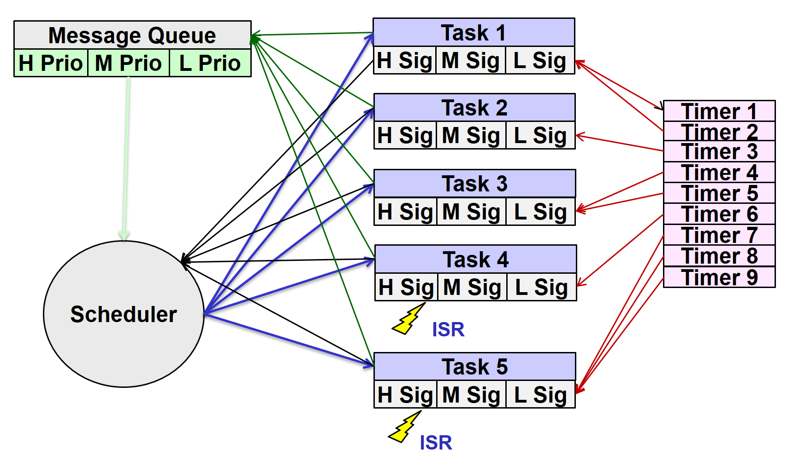

A simple _"Cooperative Scheduler"_ in _"C"_ with priorities by messages
=======================================================================

Herwig Habenbacher 2017

License: Public Domain, MIT, BSD, Apache or whatever you prefer

This file is not guaranteed by me to be error free. Every effort
has been made to ensure proper data-types and declarations, but this program
is distributed WITHOUT ANY WARRANTY; without even the implied
warranty of MERCHANTABILITY or FITNESS FOR A PARTICULAR PURPOSE.
Use it at your own risk!

## What is it?

It is a simple Scheduler I have written long ago.  
First Release around 1994, last implementation around 2009.  

The main idea is to have a *Cooperative Scheduler* which uses the same C-Stack, calling higher priority tasks is like calling a subroutine.  
Tasks have ***no*** priorities - but ***messages*** have!  
There exists only 3 priorities:  
- **high** for e.g. measurement
- **normal** for e.g. UI
- **low** for long running tasks like logging or serial communication.  

The scheduler itself is in the *Libraries* folder, I have attached a small application to show how it works...  

## Design Criteria

- enable good moduarization (message based system)
- enable testability (also for simulation)
- written in "C" (no Assembly)
- low resource consumption (RAM < 1k for 8 tasks)
- support for interrupts
- "Hard Realtime" not needed (only in ISR)
- at least one long running task supported
- tasks are communicating via messages
- every task has signal flags which clould be set by ISR
- interrupts and timers are short and can set signal flags.
- a running task may tell the scheduler to be interrupted by a higher priority task (cooperative)
- the scheduler look first at the signal flags and then on the message queue

### Overview



### Data Structures

**Events** (Communication between tasks)

```C
// -----------------------------------------------------------------------------
// definition of an event
// the field linkState may be used in two ways:
//  - in the message queue it is used like a "pointer" for linkage
//  - if sent to a task we use it to distinguish between signals and messages
typedef struct
{
  T_Byte  msg;          // message which should be dispatched or signal
  T_Byte  param;        // message parameter
  T_Byte  taskId;       // target task to which the message should be sent
  T_Byte  linkState;    // internally used link in message queue or state info
} T_Event;              // size: 4 bytes

typedef const T_Event TC_Event;
```

Fields «msg» and «param» are used for the message, a value _0xFF_ (255) is used as a "Stopper"  

**Signals** (Communication from ISR and Timer)

```C
// -----------------------------------------------------------------------------
// definition of an task signal
// the idea is that we can use up to 8 signals (bits) with 3 priorities per task
// so some communication may be done via signals instead of messages
typedef struct
{
  T_Byte  sigPrio[3];   // 8 signals with priority low / medium / high
  T_Byte  state;        // additional task state info
} TS_TaskSignal;        // size: 4 bytes
```

After reading all priorities are reset!  
The fiels «state» can be used to control the used time - a separated timer can be used for this to set the flags.  

**Tasks**

```C
// -----------------------------------------------------------------------------
// Actual task definitions
//
// Our tasks are based on the idea of "active objects"
// behind every task structure is a state machine which works for
// a small part of the complete task.
// An event is dispatched from the scheduler to the task.
// For a long working task the work may be splitted into smaller sub-parts,
// the task may send itself an event (or signaling) for resuming the work.
typedef T_Void  (*task_DispatchFunction)( TC_Event anEvent ) ;

// our fixed (const) task functions array...
typedef const task_DispatchFunction TCA_Task_array[SCHED_MAX_TASK_SIZE];
```

A task is a function pointer with an _event_ as parameter.  
In the current version the type is _void_ - so no value is returned.  

**Scheduler**

```C
// -----------------------------------------------------------------------------
// Structure for the scheduler
//
// The scheduler stores events posted to them in his message queue, sorted by
// priorities. It then dispatches the available events to the corresponding
// tasks, highest priorities first and then in the order they were posted.
typedef struct
{
  T_Event          msgQueue[SCHED_MSG_QUEUE_SIZE];  // message queue for events
  TS_TaskSignal    signals[SCHED_MAX_TASK_SIZE];    // task signals and state
  TA_MsgQueueLink  queueLinkHead;                   // link for managing the msg queue
  TA_MsgQueueLink  queueLinkTail;                   // link for managing the msq queue
  T_Event          actEvent;                        // actual scheduled event
  TE_SchedState    state;                           // scheduler state
  T_Byte           execLevel;                       // only prio events dispatched
  T_Bool           isResuming;                      // is in resuming state
  T_Bool           isInterrupted;                   // is in interrupted mode
} TS_Scheduler;                                     
```

The structure of the scheduler, it can be stopped via the «state» field.  
The "Interruptabiity" is controled via the last fields (controlled by API).  

### Task Dispatching

The dispatching looks like:  

```C
T_Void task_Housekeeping( TC_Event anEvent )
{
  if( anEvent.linkState == EVENT_STATE_IS_SIGNAL ) { // signals
    if( anEvent.msg & DISP_SIG_TIMEOUT_MASK ) {
        if( anEvent.msg & SIG_TIMER_TICK_NORMAL )
          HousekeepingHandler_Handle( cnstEvent_Tick_Normal );
        if( anEvent.msg & SIG_HSK_GO_POWERSAVE )  
          HousekeepingHandler_Handle( cnstEvent_Go_Powersave );
      }
   }
  else {// messages
     switch ( anEvent.msg )
     {
       case MSG_INITIALIZE: HousekeepingHandler_Initialize();  break;
       case MSG_RESET:      HousekeepingHandler_Reset();       break;
       case MSG_FINALIZE:   HousekeepingHandler_Finalize();    break;
       default:
         // all other messages should be handled directly in the handler
         HousekeepingHandler_Handle( anEvent );
     }
   }
}
```

First *signals* are handled, then *messages* - **ALL** *signals* in a row.   
Here is shown how to handle the default messages.  

#### Long running tasks

In princible every task runs until he is finished.  
You can handle long running tasks in two ways:

- divide the blocks manually with a State Machine
- call `sched_Resume()` in lower priority task

Is `sched_Resume()` called in a lower priority task, the scheduler is called like a subroutine. Now higher prioritized *signals* and *messages* are processed, then the scheduler returns from the call.  
This has some benefits:

- nearly no Synchronisation needed, it is just a subroutine call
- only one "C" Stack is used (less Resources)

#### ISR (Interrupt Service Routine)

In this routines I tried to use only _Lock-Free_ structures.

#### Software Timer

Data Structure:  

```C
// -----------------------------------------------------------------------------
// Actual timer handling function definition
//   an optional argument may be the timer number - so in the handling
//   function we will know which timer has called...
typedef T_Void  (*timer_HandlerFunction)( TC_Uint32 aTimer ) ;

// -----------------------------------------------------------------------------
// definition of an actual used timer definition entry
typedef struct
{
  T_Uint32                timeOutVal;     // actual timeout count (min time)
  T_Uint32                timeOutValMax;  // maximum timeout count for variable timer
  timer_HandlerFunction   handler;        // handler function
  T_Bool                  doAutoreload;   // reload to timeOutVal after timeout
  T_Bool                  isDefaultOn;    // timer is by default enabled
  T_Bool                  isVariable;     // timeout time may be variable
} TS_TimeoutDefinition;
```

This timers were used to set the corresponding *signal flags*  

By watching the timing of the tasks and carefully adjust the scheduler to them you get a pretty stable system!  
  
Have fun to play with it!  
